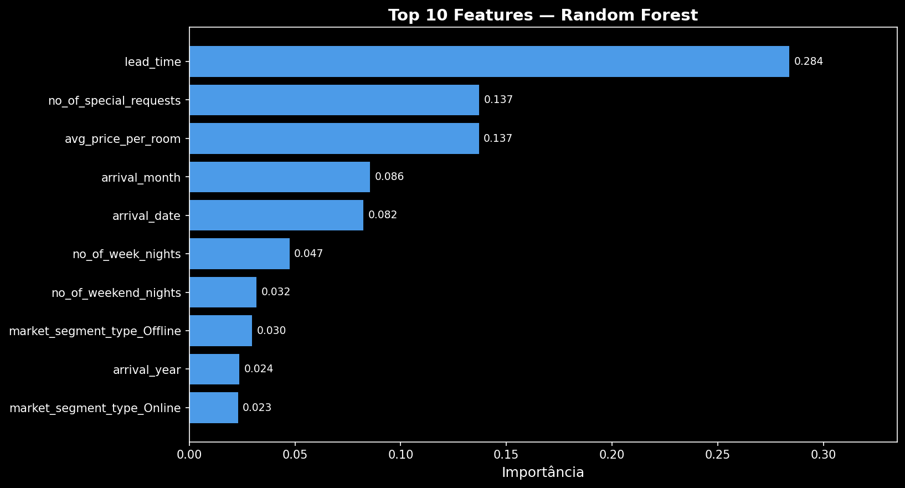
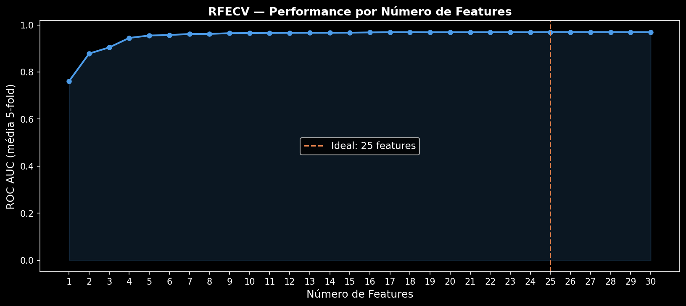
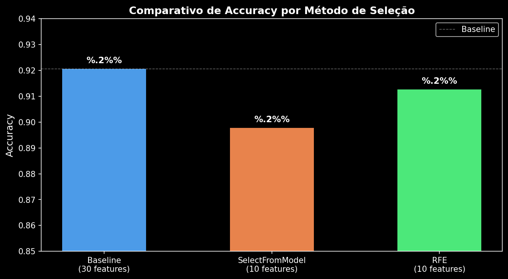
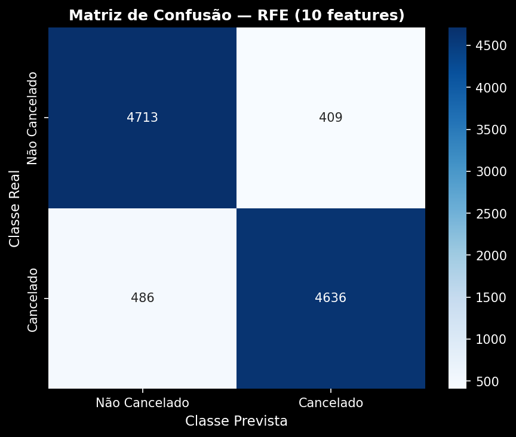
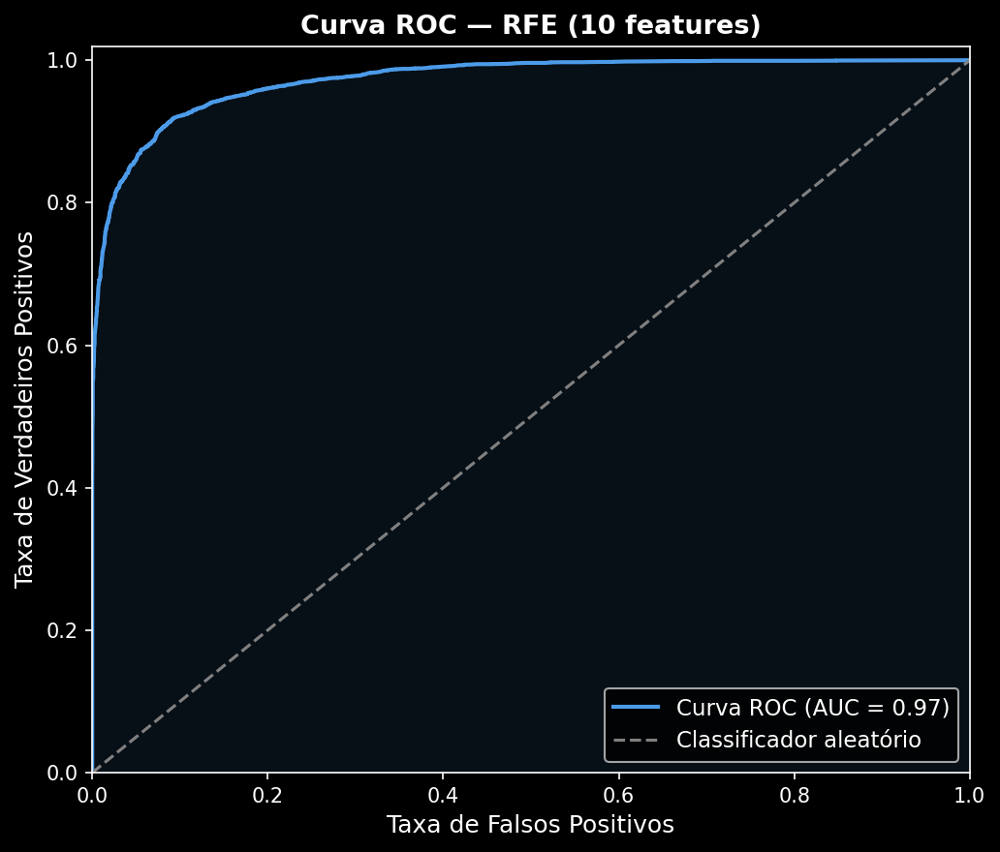

# Projeto Completo — Seleção de Features

Projeto de Machine Learning focado em técnicas de seleção de features para predição de cancelamento de reservas hoteleiras. O notebook cobre desde a análise exploratória até a aplicação automatizada de métodos de seleção, com avaliação comparativa de resultados.

## Problema

Prever se uma reserva de hotel será cancelada (`booking_status`: 0 = não cancelada, 1 = cancelada) com base em 30 features. O dataset é balanceado (50%/50%) e contém **34.146 registros** sem valores nulos.

**Dataset:** [Hotel Booking Demand](https://raw.githubusercontent.com/allanspadini/dados-com-muitas-dimensoes/main/dados/hotel.csv)

## Estrutura do Notebook

### Aula 1 — Entendendo o problema
- Carregamento e exploração do dataset
- Treinamento do modelo base com todas as features
- **Score baseline:** `RandomForestClassifier` → **92,06%**

### Aula 2 — Análise de dados
- Visualização de distribuições por classe (boxplot e violinplot)
- Mapa de correlação entre features (heatmap)
- Feature Importance a partir do Random Forest



### Aula 3 — Automatizando a seleção
- **`SelectFromModel`** com top 10 features → Score: **89,77%**
- **`GridSearchCV`** para otimização de hiperparâmetros
- Avaliação com Matriz de Confusão e Curva ROC

### Aula 4 — Avaliação dos resultados
- **`RFE`** (Recursive Feature Elimination) com 10 features → Score: **91,26%**
- **`RFECV`** com StratifiedKFold (5 folds) → Número ideal de features: **25** → ROC AUC: **~0.9699**
- Visualização comparativa do desempenho por número de features



## Resultados Comparativos

| Método | Features | Score (Accuracy) |
|---|---|---|
| Baseline (todas as features) | 30 | 92,06% |
| SelectFromModel | 10 | 89,77% |
| RFE | 10 | 91,26% |
| RFECV | 25 | ~96,99% (ROC AUC) |



### Matriz de Confusão — RFE



### Curva ROC — RFE



## Tecnologias

- Python 3.10
- pandas
- scikit-learn (`RandomForestClassifier`, `SelectFromModel`, `RFE`, `RFECV`, `GridSearchCV`)
- seaborn / matplotlib

## Como executar

```bash
pip install pandas scikit-learn seaborn matplotlib
jupyter notebook Projeto_completo_selecao_de_features.ipynb
```
